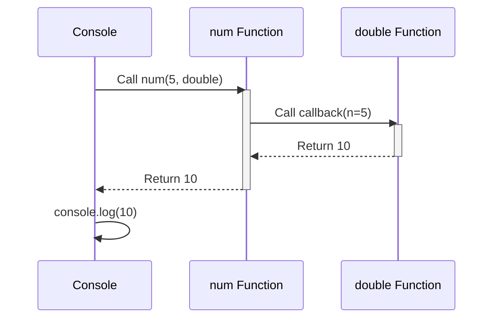
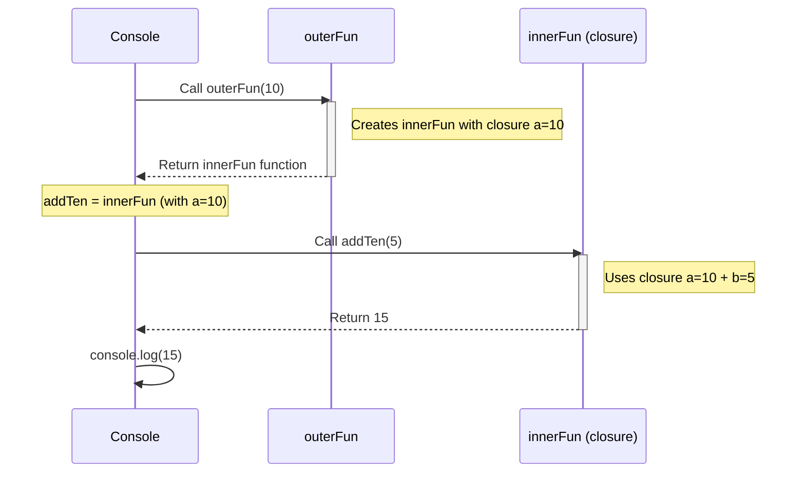

# Functions and Events

### 1. Functions in JS

<br>

### 2. Calling Function

<br>

### 3. arrow Functions 


<br>

### 4. Callback functions
```javascript
function num(n, callback) {
    return callback(n);
}

const double = (n) => n * 2;

console.log(num(5, double)); 
```


### 5. Nested Functions
```javascript
function outerFun(a) {
    function innerFun(b) {
        return a + b;
    }
    return innerFun;
}
const addTen = outerFun(10);
console.log(addTen(5));

```
