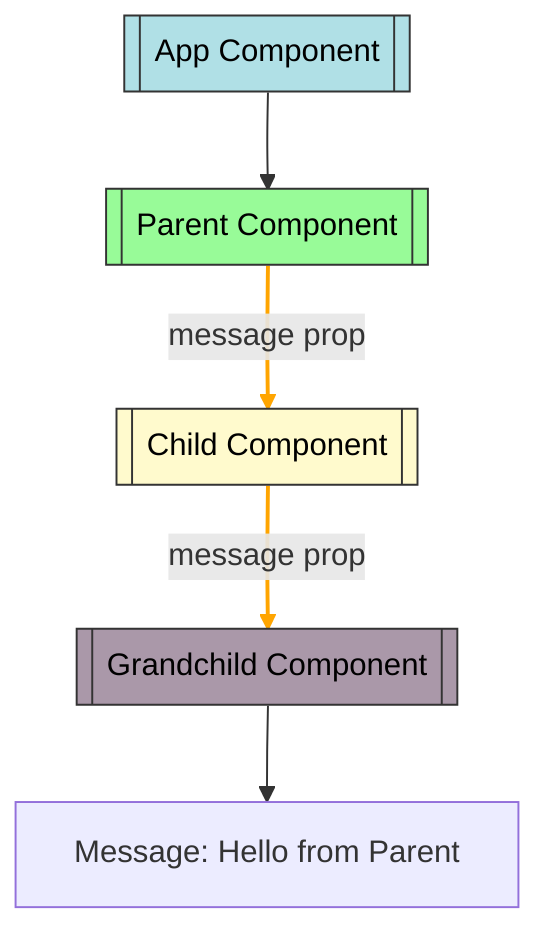
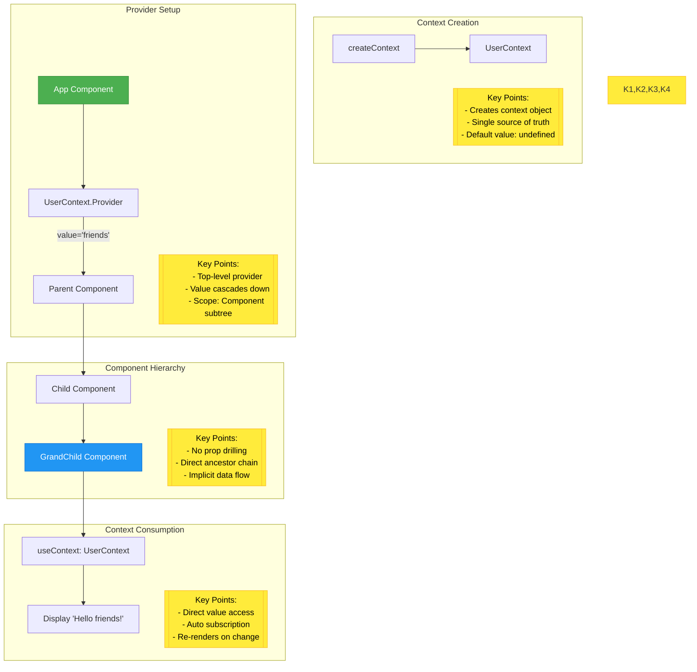
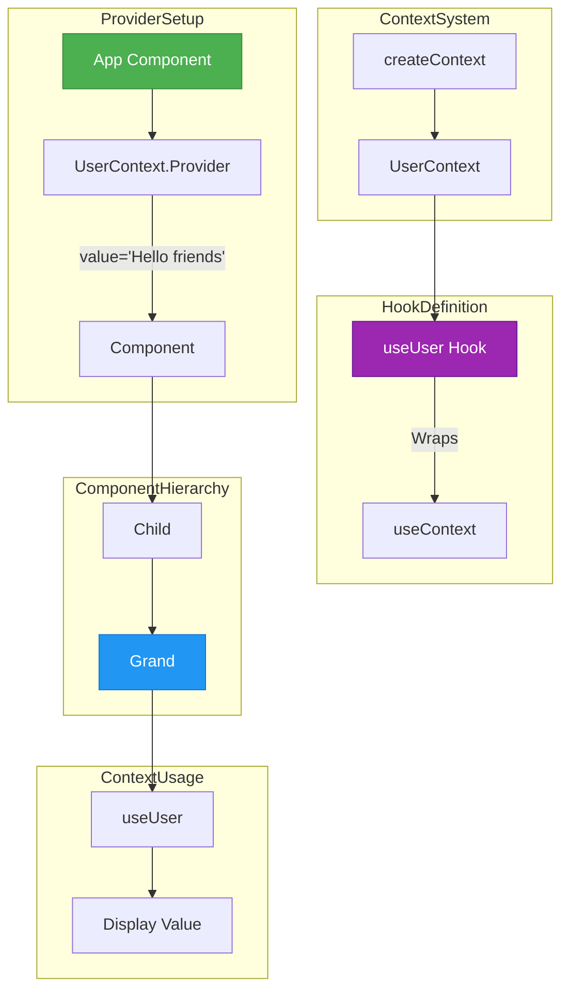

# Prop drilling


<br> 
<br>

# How to avoid prop drilling 

1. <strong> Using Prop Drilling</strong>
   - The React Context API provides a way to share values (like state, functions, or constants) between components without explicitly passing props.

<br>

```javascript
    import React, { createContext, useContext } from 'react';
const UserContext = createContext();
const App = () => {
    const userName = 'friends';
    return (
        <UserContext.Provider value={userName}>
            <Parent />
        </UserContext.Provider>
    );
};
const Parent = () => {
    return <Child />;
};
const Child = () => {
    return <GrandChild />;
};
const GrandChild = () => {
    const userName = useContext(UserContext); // Access context value
    return <p>Hello, {userName}!</p>;
};
export default App;

```
<br>

### Architecture



<br>

- <u><strong>createContext()</strong></u> creates a context (UserContext) to share data across components.
- The App component uses <strong>UserContext.Provider</strong> to pass userName (‘geeksforgeeks’) as <strong>the context value</strong>.
- <strong>ParentComponent</strong> and its children (ChildComponent, GrandChildComponent) are wrapped by the <strong>provider</strong>.
- <strong>GrandChildComponent</strong> accesses the context value using <strong>useContext(UserContext)</strong>.
- The value (‘friends’) is displayed in p tag as “Hello friends!”.


<br>
<br>


2. <strong>Using custom hooks</strong>
   - Custom hooks are reusable functions in React that encapsulate stateful logic, starting with use (e.g., useFetch). They improve code reusability, keep components clean, and allow sharing logic across components.

```javascript
import React, { createContext, useContext } from "react";

const UserContext = createContext();
const useUser = () => useContext(UserContext);

const App = () => {
    const userName = "Hello friends";
    return (
        <UserContext.Provider value={userName}>
            <Component />
        </UserContext.Provider>
    );
};

const Component = () => <Child />;
const Child = () => <Grand />;
const Grand = () => {
    const userName = useUser();
    return <p>Hello, {userName}!</p>;
};

export default App;

```

### Architecture Flow Diagram



<br>

- createContext() creates UserContext to share data across components.
- useUser() is a custom hook wrapping useContext(UserContext) for simplicity.
- App provides the context value (“friends”) using UserContext.Provider.
- Nested components (Component, Child, Grand) inherit the context value.
- Grand accesses the value via useUser() and displays “Hello, friends!