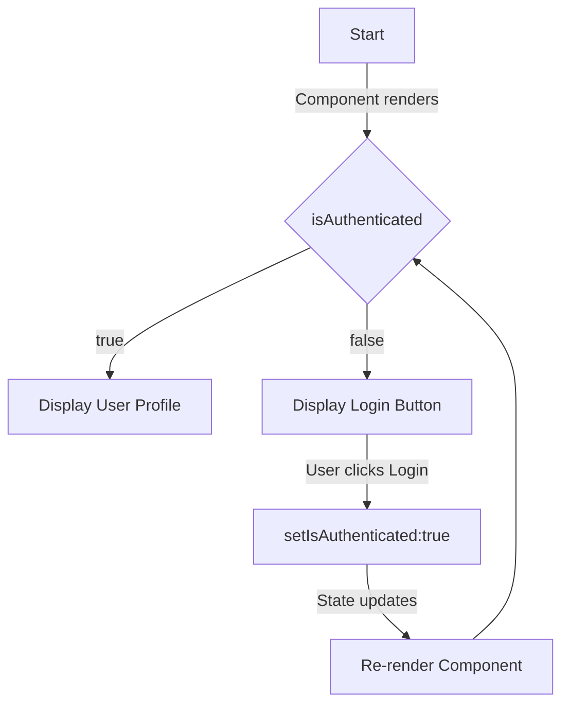
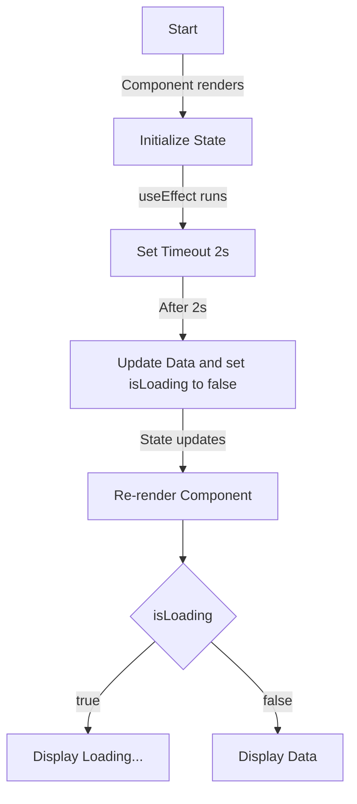

## Displaying User Profile based on Authentication 
- You can conditionally render a user’s profile page if the user is logged in, or a login form if not.

## Showing loading State 
- You can display a loading spinner or message while waiting for data to be fetched.

