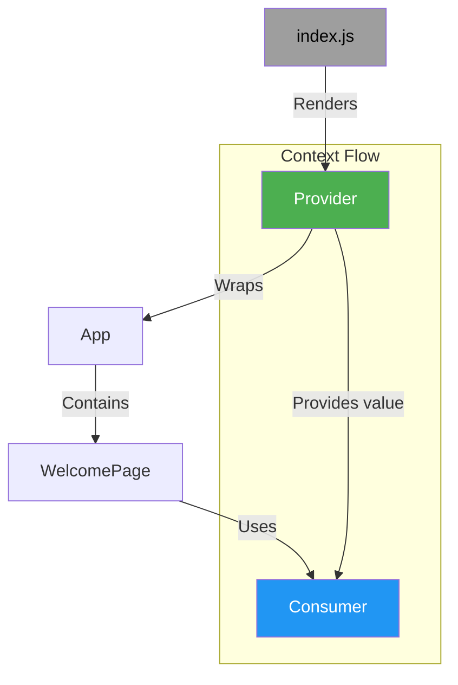

# React Context API Documentation

## Overview
This application demonstrates React Context API usage with Provider-Consumer pattern to pass data through the component tree without prop drilling.

### Component Structure
```
index.js
└── Provider (Context)
    └── App
        └── WelcomePage
            └── Consumer (Context)
```

## Key Files Breakdown

### 1. Context.js
```javascript
import React from 'react';
const UserContext = React.createContext();
export const Provider = UserContext.Provider;
export const Consumer = UserContext.Consumer;
```
- Creates a context object using `React.createContext()`
- Exports Provider and Consumer components for context access

### 2. index.js
```javascript
import { Provider } from './Context';

ReactDOM.render(
  <Provider value={{ name: "Geeksforgeeks", id: 195 }}>
    <App />
  </Provider>,
  document.getElementById('root')
);
```
- Wraps root component with Context Provider
- Provides context value containing user data object

### 3. App.js
```javascript
function App() {
  return (
    <div className="App">
      <WelcomePage/>
    </div>
  );
}
```
- Main application component
- Renders WelcomePage component

### 4. WelcomePage.js
```javascript
import { Consumer } from "./Context";

const WelcomePage = () => {
  return (
    <Consumer>
      {(value) => <h2>Name: {value.name} id: {value.id}</h2>}
    </Consumer>
  );
};
```
- Uses Context Consumer to access provided values
- Implements render prop pattern to display context data

## Data Flow Diagram (Mermaid)



## Flow Explanation
1. **Root Initialization** (`index.js`)
   - Creates context Provider with initial value
   - Renders App component within Provider context

2. **Context Provision**

   ```mermaid
   flowchart LR
   P[Provider] -->|value=  name, id | C[Context Store]
   ```

3. **Component Hierarchy**
   ```
   Provider -> App -> WelcomePage
   ```

4. **Context Consumption**
   ```mermaid
   flowchart LR
   WelcomePage -->|Consumer| C[Context Store]
   C -->|value| R[Render Function]
   R -->|JSX| D[Display Data]
   ```

## Key Features
1. **Prop-less Data Passing**: Eliminates need for manual prop drilling
2. **Centralized Data**: Context values managed at root level
3. **Dynamic Updates**: Consumers automatically re-render on context changes
4. **Component Decoupling**: Components access data without direct parent-child relationships

## Usage Pattern
```javascript
// Provider Declaration
<Provider value={/* your data */}>
  {/* child components */}
</Provider>

// Consumer Usage
<Consumer>
  {value => /* render using value */}
</Consumer>
```

This implementation demonstrates fundamental React Context API usage for state management across components. The Provider-Consumer pattern enables efficient data sharing while maintaining component independence.