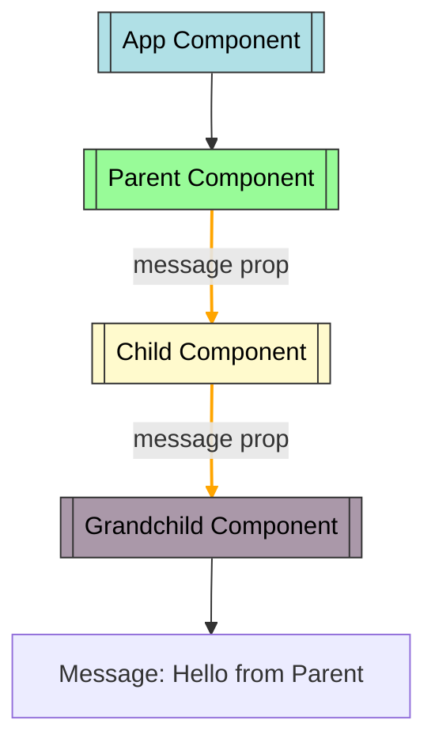

```mermaid 
%%{init: {'themeVariables': {'fontSize': '16px', }}}%%
flowchart TD
    classDef app fill:#b0e0e6,stroke:#333, color: #000000;
    classDef parent fill:#98fb98,stroke:#333, color: #000000;
    classDef child fill:#fffacd,stroke:#333, color: #000000;
    classDef grandchild fill:#AA98A9,stroke:#333, color: #000000;

    App[[App Component]]:::app
    Parent[[Parent Component]]:::parent
    Child[[Child Component]]:::child
    Grandchild[[Grandchild Component]]:::grandchild

    App --> Parent
    Parent --> |" message prop "| Child
    Child --> |" message prop "| Grandchild
    Grandchild --> Display["Message: Hello from Parent"]
    
    linkStyle 1 stroke:#ffa500,stroke-width:2px
    linkStyle 2 stroke:#ffa500,stroke-width:2px

```