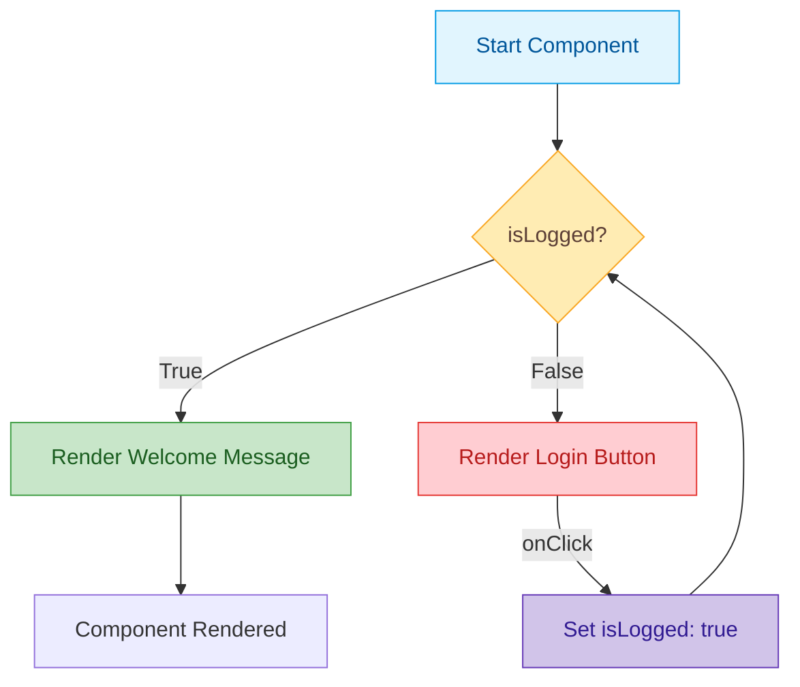
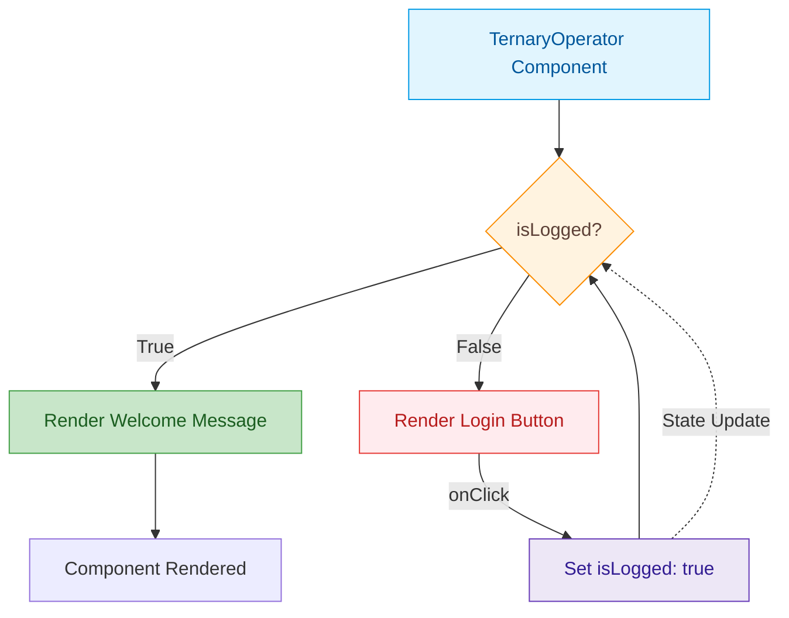
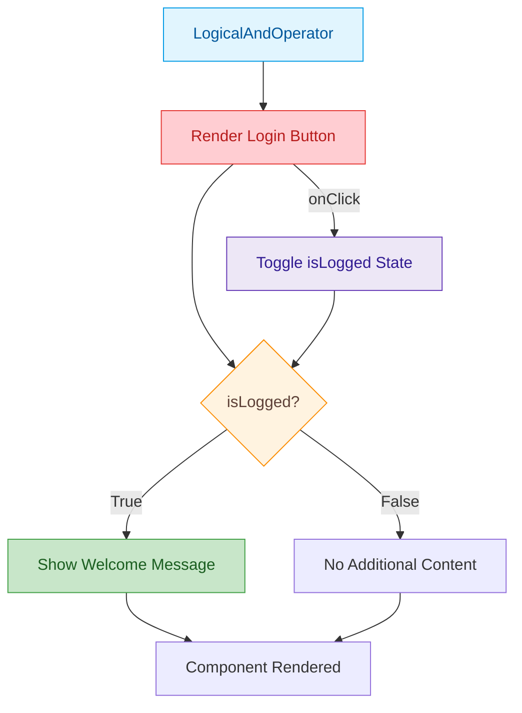
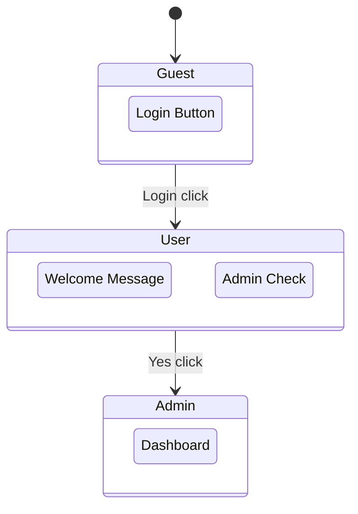

## Using If/Else Statements
- This method works well when the condition is more complex.

 

## Using Ternary Operator 
- The ternary operator (condition ? expr1 : expr2) is a concise way to conditionally render JSX elements.
- It’s often used when the logic is simple and there are only two options to render.

 

## Logical AND operator 
- In JavaScript, the && operator returns the second operand if the first is true, and nothing if the first is false. 
- This can be useful when you only want to render something when a condition is true.

## Using switch case statements
- Switch case statements are useful when you need to handle multiple conditions, which would otherwise require multiple if conditions.
- This approach can be more readable if there are many conditions to check.

