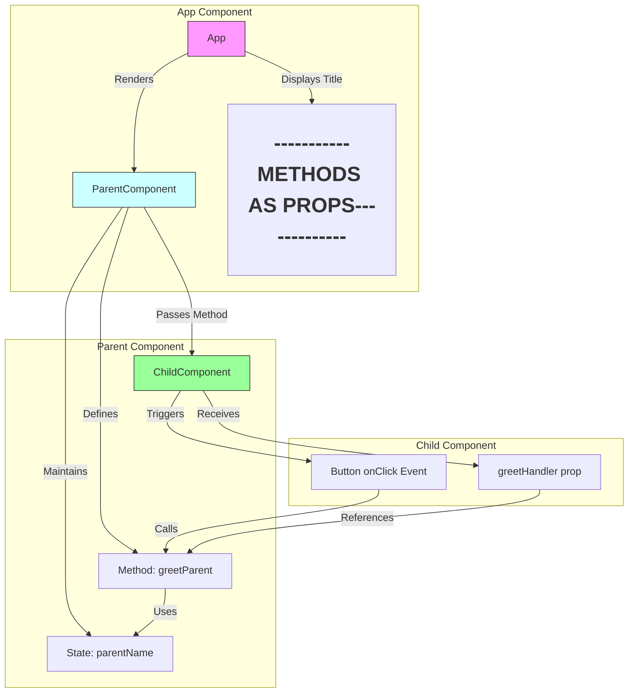

An architecture diagram and flow explanation for passing methods as props in ReactJS based on the code:




### Key Components & Flow:

1. **Root Component (App)**
   ```jsx
   function App() {
       return (
           <div className="App">
               <h1>-----------METHODS AS PROPS-------------</h1>
               <ParentComponent />
           </div>
       );
   }
   ```
   - **Pink Section**: Acts as container
   - Renders the `<ParentComponent>`
   - Displays static header content

2. **Parent Component**
   ```jsx
   class ParentComponent extends Component {
       constructor() {
           this.state = { parentName: 'Parent' };
           this.greetParent = this.greetParent.bind(this);
       }

       greetParent() {
           alert(`Hello ${this.state.parentName}`);
       }

       render() {
           return <ChildComponent greetHandler={this.greetParent} />;
       }
   }
   ```
   - **Blue Section**: Manages state and logic
   - Maintains `parentName` in state
   - Defines `greetParent` method (bound to component instance)
   - Passes method to child via props:  
     `greetHandler={this.greetParent}`

3. **Child Component**
   ```jsx
   function ChildComponent(props) {
       return (
           <button onClick={() => props.greetHandler()}>
               Greet Parent
           </button>
       );
   }
   ```
   - **Green Section**: Handles interaction
   - Receives method as prop (`greetHandler`)
   - Triggers parent method through button click
   - Uses arrow function to preserve context

### Data Flow Sequence:
1. **Initialization**:
   - App renders ParentComponent
   - ParentComponent initializes state and binds method

2. **Method Passing**:
   ```mermaid
   graph LR
   B[Parent] -->|Passes Method| E[Child]
   style B fill:#cff,stroke:#333
   style E fill:#9f9,stroke:#333
   ```

4. **User Interaction**:
   ```mermaid
   graph LR
   G[Button Click] -->|Calls| D[greetParent]
    style G fill:#ff9,stroke:#333
    style D fill:#cff,stroke:#333
   ```

5. **Execution Flow**:
   - Button click in ChildComponent
   - Calls `props.greetHandler()`
   - Executes ParentComponent's `greetParent()`
   - Accesses ParentComponent's state (`parentName`)
   - Shows alert with state value

### Key Concepts Illustrated:
1. **Unidirectional Data Flow**  
   (Parent → Child only via props)

2. **State Management**  
   (State maintained in parent component)

3. **Method Binding**  
   (Essential for `this` context preservation)

4. **Cross-Component Communication**  
   (Child-to-parent communication via callbacks)

5. **Prop Drilling**  
   (Passing functions through component hierarchy)

This pattern enables child components to trigger actions in parent components while maintaining React's core principle of unidirectional data flow. It's particularly useful for:
- Form handling
- State lifting
- Creating reusable components
- Implementing complex interactions between components


### Data Flow:
1. **App Component**
   - Root component
   - Renders ParentComponent
   - Contains static title display

2. **ParentComponent**
   - Maintains state with `parentName`
   - Defines `greetParent()` method
   - Passes method to child via `greetHandler` prop
   ```jsx
   <ChildComponent greetHandler={this.greetParent}/>
   ```

3. **ChildComponent**
   - Receives method as prop
   - Triggers parent method through event
   ```jsx
   <button onClick={() => props.greetHandler()}>
   ```

### Key Characteristics:
1. **Unidirectional Data Flow**:
   - Parent → Child communication only
   - Data flows down through props

2. **Method Binding**:
   - Parent component binds method in constructor
   ```jsx
   this.greetParent = this.greetParent.bind(this)
   ```

3. **Event Handling**:
   - Child component triggers parent method via prop
   - Uses arrow function to maintain context

4. **Component Hierarchy**:
   ```
   App
   └── ParentComponent
       └── ChildComponent
   ```

### Sequence Diagram:
```
┌──────┐         ┌─────────────┐         ┌────────────┐
│ App  │         │ Parent      │         │ Child      │
└──┬───┘         └──────┬──────┘         └─────┬──────┘
   │     Render Parent  │                      │
   │ ──────────────────>│                      │
   │                    │  Pass greetHandler   │
   │                    │ ────────────────────>│
   │                    │                      │  User clicks
   │                    │                      │ ────┐
   │                    │      Call handler    │ <───┘
   │                    │<─────────────────────│
   │  [Alert Displayed] │                      │
   │ <──────────────────│                      │
┌──┴───┐         ┌──────┴──────┐         ┌─────┴──────┐
│ App  │         │ Parent      │         │ Child      │
└──────┘         └─────────────┘         └────────────┘
```

This pattern enables:
- State management in parent components
- Reusable presentational child components
- Clear separation of concerns
- Easy testing of component interactions

Remember this is a fundamental React pattern used for:
- Lifting state up
- Creating controlled components
- Implementing callback patterns
- Managing cross-component communication
