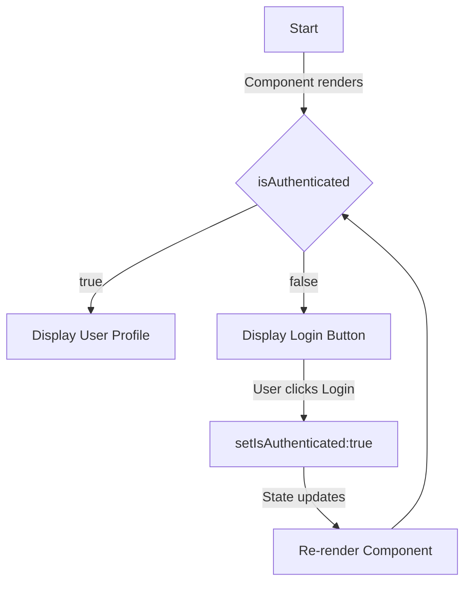

```mermaid
graph TD;
  A[Start] -->|Component renders| B{isAuthenticated}
  B -->|true| C[Display User Profile]
  B -->|false| D[Display Login Button]
  D -->|User clicks Login| E[setIsAuthenticated:true]
  E -->|State updates| F[Re-render Component]
  F --> B
```